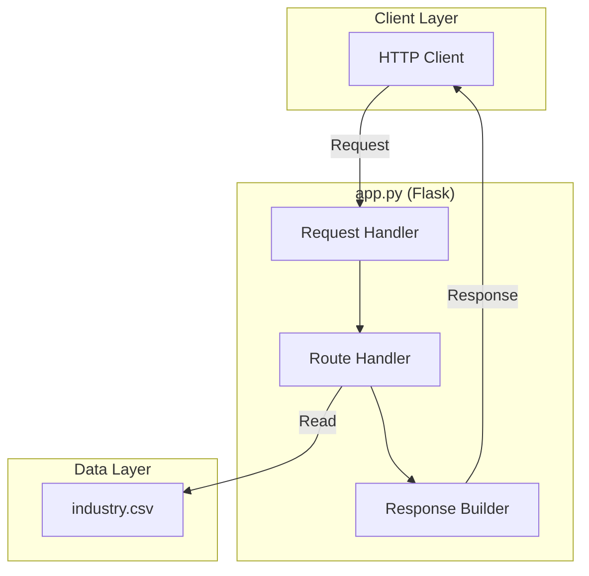
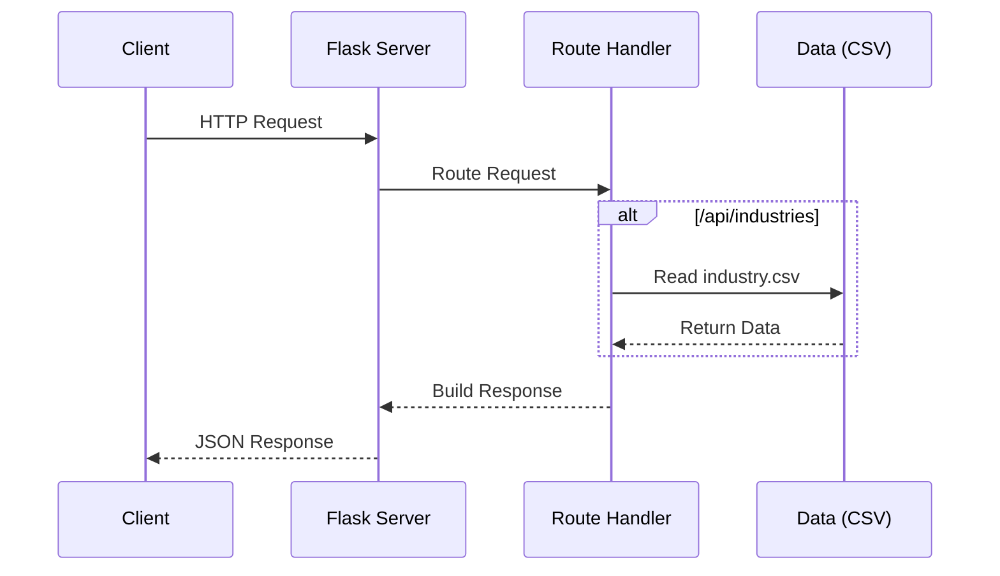

# hello_world


A lightweight Python Flask HTTP server demonstrating RESTful API design with comprehensive documentation.

---

## Table of Contents

- [Overview](#overview)
- [Features](#features)
- [Prerequisites](#prerequisites)
- [Installation](#installation)
- [Configuration](#configuration)
- [Usage](#usage)
- [API Reference](#api-reference)
  - [GET /](#get-)
  - [GET /health](#get-health)
  - [GET /api/industries](#get-apiindustries)
- [Deployment](#deployment)
- [Development](#development)
- [Project Structure](#project-structure)
- [Contributing](#contributing)
- [License](#license)

---

## Overview

**hello_world** is a Python Flask HTTP server application that serves as both a functional API server and a documentation example project. It provides three RESTful endpoints for serving welcome messages, health status, and industry taxonomy data.

This project has a dual purpose:
1. **Functional Server**: A working HTTP server with REST API endpoints demonstrating Flask best practices
2. **Documentation Example**: A showcase of comprehensive Python documentation with docstrings and project documentation standards

The server is a Python rewrite of the original Node.js implementation, maintaining identical API functionality and response formats. It uses Flask as the web framework with minimal dependencies.

### Architecture Overview



---

## Features

- **HTTP Server**: Built on Flask framework for lightweight, production-ready deployment
- **REST API Endpoints**: Three well-documented endpoints following REST conventions
- **Health Check Endpoint**: Built-in health monitoring for load balancers and orchestrators
- **Industry Data API**: Serves industry taxonomy data from CSV data source
- **JSON Responses**: All endpoints return consistently formatted JSON responses
- **CORS Support**: Cross-Origin Resource Sharing enabled for browser-based clients
- **Graceful Shutdown**: Proper handling of keyboard interrupts for clean shutdowns
- **Comprehensive Documentation**: Full Python docstrings and inline code explanations
- **Production Ready**: Includes Gunicorn support for production deployments

---

## Prerequisites

Before installing and running this project, ensure you have the following installed:

| Requirement | Minimum Version | Recommended Version | Purpose |
|-------------|-----------------|---------------------|---------|
| Python | v3.8 | v3.10 or later | Python runtime |
| pip | v20.0 | v23.x or later | Package manager |
| Git | v2.0.0 | Latest | Version control |

### Verifying Prerequisites

```bash
# Check Python version
python3 --version
# Expected: Python 3.8.0 or higher

# Check pip version
pip3 --version
# Expected: pip 20.0 or higher

# Check Git version
git --version
# Expected: git version 2.x.x
```

---

## Installation

Follow these steps to set up the project locally:

### Step 1: Clone the Repository

```bash
git clone <repository-url>
cd hello_world
```

### Step 2: Create Virtual Environment (Recommended)

```bash
# Create virtual environment
python3 -m venv venv

# Activate virtual environment (Linux/macOS)
source venv/bin/activate

# Activate virtual environment (Windows)
venv\Scripts\activate
```

### Step 3: Install Dependencies

```bash
pip install -r requirements.txt
```

> **Note**: This installs Flask and optional production/testing dependencies.

### Step 4: Verify Installation

```bash
# Start the server to verify installation
python app.py

# You should see output similar to:
# Server running at http://localhost:3000/
```

### Step 5: Test the Installation

In a new terminal window:

```bash
# Test the root endpoint
curl http://localhost:3000/

# Expected response:
# {
#   "success": true,
#   "message": "Welcome to hello_world API",
#   "version": "1.0.0",
#   ...
# }
```

---

## Configuration

The server can be configured using environment variables:

| Variable | Description | Default | Example |
|----------|-------------|---------|---------|
| `PORT` | Port number for the HTTP server | `3000` | `8080` |
| `HOST` | Hostname/IP address to bind to | `localhost` | `0.0.0.0` |
| `FLASK_ENV` | Environment mode | `development` | `production` |
| `FLASK_DEBUG` | Enable debug mode | `0` | `1` |

### Setting Environment Variables

#### Linux/macOS

```bash
# Set variables inline
PORT=8080 HOST=0.0.0.0 python app.py

# Or export for current session
export PORT=8080
export HOST=0.0.0.0
python app.py
```

#### Windows (Command Prompt)

```cmd
set PORT=8080
set HOST=0.0.0.0
python app.py
```

#### Windows (PowerShell)

```powershell
$env:PORT = "8080"
$env:HOST = "0.0.0.0"
python app.py
```

### Environment File (Optional)

Create a `.env` file in the project root (requires `python-dotenv` package):

```env
PORT=3000
HOST=localhost
FLASK_ENV=development
FLASK_DEBUG=0
```

---

## Usage

### Starting the Server

```bash
# Start the server (default: http://localhost:3000)
python app.py

# Start with custom port
PORT=8080 python app.py

# Start with Flask CLI
flask run --port=3000

# Start with Gunicorn (production)
gunicorn -w 4 -b 0.0.0.0:3000 app:app
```

### Running Tests

```bash
# Run test suite with pytest
pytest

# Run with verbose output
pytest -v

# Run with coverage
pytest --cov=app
```

### Generating Documentation

```bash
# Generate documentation with pydoc
python -m pydoc -w app

# Or use Sphinx for comprehensive docs (if configured)
# sphinx-build -b html docs/source docs/build
```

### Stopping the Server

Press `Ctrl+C` to gracefully stop the server.

---

## API Reference

All endpoints return JSON responses with a consistent format:

```json
{
  "success": true|false,
  "message": "Human-readable message",
  "data": "Response data (format varies by endpoint)",
  "error": "Error message (only on failure)"
}
```

### Request Flow



---

### GET /

Returns a welcome message with API version and available endpoints documentation.

**Request**

```http
GET / HTTP/1.1
Host: localhost:3000
```

**Response**

| Status Code | Description |
|-------------|-------------|
| `200 OK` | Successful request |

**Response Body**

```json
{
  "success": true,
  "message": "Welcome to hello_world API",
  "version": "1.0.0",
  "endpoints": {
    "GET /": "This welcome message",
    "GET /health": "Health check endpoint",
    "GET /api/industries": "List of industry categories"
  }
}
```

**Example**

```bash
curl -X GET http://localhost:3000/
```

---

### GET /health

Returns the current health status, timestamp, and server uptime. Used by load balancers and monitoring systems to verify server availability.

**Request**

```http
GET /health HTTP/1.1
Host: localhost:3000
```

**Response**

| Status Code | Description |
|-------------|-------------|
| `200 OK` | Server is healthy |

**Response Body**

```json
{
  "success": true,
  "status": "ok",
  "timestamp": "2024-01-15T10:30:00.000000",
  "uptime": 3600
}
```

**Response Fields**

| Field | Type | Description |
|-------|------|-------------|
| `success` | boolean | Always `true` for successful requests |
| `status` | string | Health status (`"ok"` when healthy) |
| `timestamp` | string | ISO 8601 formatted timestamp |
| `uptime` | number | Server uptime in seconds |

**Example**

```bash
curl -X GET http://localhost:3000/health
```

**Use Cases**

- Kubernetes liveness/readiness probes
- Load balancer health checks
- Monitoring system integration
- Service discovery health verification

---

### GET /api/industries

Returns a list of industry categories loaded from the `industry.csv` data file.

**Request**

```http
GET /api/industries HTTP/1.1
Host: localhost:3000
```

**Response**

| Status Code | Description |
|-------------|-------------|
| `200 OK` | Successful request |
| `500 Internal Server Error` | Failed to read data file |

**Success Response Body**

```json
{
  "success": true,
  "data": [
    "Accounting/Finance",
    "Advertising/Public Relations",
    "Aerospace/Aviation",
    "Arts/Entertainment/Publishing",
    "Automotive",
    "Banking/Mortgage",
    "Business Development",
    "Business Opportunity",
    "..."
  ],
  "count": 43
}
```

**Response Fields**

| Field | Type | Description |
|-------|------|-------------|
| `success` | boolean | Indicates if the request was successful |
| `data` | string[] | Array of industry category names |
| `count` | number | Total number of industries returned |

**Error Response Body**

```json
{
  "success": false,
  "error": "Failed to load industries data",
  "details": "No such file or directory"
}
```

**Example**

```bash
curl -X GET http://localhost:3000/api/industries
```

**Available Industries**

The endpoint returns 43 industry categories including:
- Accounting/Finance
- Advertising/Public Relations
- Healthcare
- Technology
- Manufacturing/Operations
- And 38 more...

---

## Deployment

### Production Environment Setup

1. **Configure Environment Variables**

   ```bash
   # Set production environment
   export FLASK_ENV=production
   
   # Bind to all interfaces for external access
   export HOST=0.0.0.0
   
   # Set appropriate port (often 80 or behind reverse proxy)
   export PORT=3000
   ```

2. **Verify Data Files**

   Ensure `industry.csv` is present in the deployment directory:

   ```bash
   ls -la industry.csv
   ```

### Deployment Commands

#### Direct Deployment (Development Only)

```bash
# Start server in production mode
FLASK_ENV=production HOST=0.0.0.0 PORT=3000 python app.py
```

#### Using Gunicorn (Recommended for Production)

```bash
# Install Gunicorn (if not already in requirements.txt)
pip install gunicorn

# Start with Gunicorn (4 workers)
gunicorn -w 4 -b 0.0.0.0:3000 app:app

# Start with Gunicorn (with logging)
gunicorn -w 4 -b 0.0.0.0:3000 --access-logfile - --error-logfile - app:app

# Start as daemon
gunicorn -w 4 -b 0.0.0.0:3000 --daemon app:app
```

#### Using Systemd Service

Create `/etc/systemd/system/hello_world.service`:

```ini
[Unit]
Description=hello_world Flask Application
After=network.target

[Service]
User=www-data
Group=www-data
WorkingDirectory=/path/to/hello_world
Environment="PATH=/path/to/hello_world/venv/bin"
Environment="PORT=3000"
Environment="HOST=0.0.0.0"
ExecStart=/path/to/hello_world/venv/bin/gunicorn -w 4 -b 0.0.0.0:3000 app:app

[Install]
WantedBy=multi-user.target
```

Enable and start:

```bash
sudo systemctl enable hello_world
sudo systemctl start hello_world
sudo systemctl status hello_world
```

#### Docker Deployment

Create a `Dockerfile`:

```dockerfile
FROM python:3.10-slim

WORKDIR /app

COPY requirements.txt .
RUN pip install --no-cache-dir -r requirements.txt

COPY . .

EXPOSE 3000

ENV FLASK_ENV=production
ENV HOST=0.0.0.0
ENV PORT=3000

CMD ["gunicorn", "-w", "4", "-b", "0.0.0.0:3000", "app:app"]
```

Build and run:

```bash
# Build image
docker build -t hello_world:1.0.0 .

# Run container
docker run -d -p 3000:3000 --name hello_world hello_world:1.0.0

# View logs
docker logs hello_world

# Stop container
docker stop hello_world
```

### Verification Procedures

After deployment, verify the server is running correctly:

```bash
# 1. Check root endpoint
curl http://your-server:3000/
# Expected: JSON with welcome message

# 2. Check health endpoint
curl http://your-server:3000/health
# Expected: {"success":true,"status":"ok",...}

# 3. Check API endpoint
curl http://your-server:3000/api/industries
# Expected: {"success":true,"data":[...],"count":43}

# 4. Verify error handling
curl http://your-server:3000/nonexistent
# Expected: 404 response with available endpoints
```

### Production Considerations

- **Reverse Proxy**: Use Nginx or Apache as a reverse proxy for SSL termination
- **Logging**: Configure proper logging for production monitoring
- **Security**: Restrict CORS origins in production by modifying the response headers
- **Scaling**: Use Gunicorn with multiple workers or container orchestration for horizontal scaling
- **Monitoring**: Integrate with APM tools (New Relic, Datadog, etc.)

---

## Development

### Development Workflow

1. **Set Up Development Environment**

   ```bash
   # Create virtual environment
   python3 -m venv venv
   source venv/bin/activate  # Linux/macOS
   
   # Install dependencies
   pip install -r requirements.txt
   ```

2. **Start Development Server**

   ```bash
   # Start server with debug mode
   FLASK_DEBUG=1 python app.py
   
   # Or use Flask CLI
   flask run --debug --port=3000
   ```

3. **Test Changes**

   ```bash
   # Test endpoints manually
   curl http://localhost:3000/
   curl http://localhost:3000/health
   curl http://localhost:3000/api/industries
   
   # Run test suite
   pytest -v
   ```

### Code Style and Conventions

- **Python**: Follow PEP 8 style guide
- **Docstrings**: Google-style docstrings for all functions and modules
- **Type Hints**: Use type annotations for function parameters and returns
- **Naming**: snake_case for functions/variables, UPPER_CASE for constants
- **Formatting**: Consistent indentation (4 spaces), line length <= 100 characters

### Docstring Conventions

All functions should include docstrings following this pattern:

```python
def function_name(param1: Type1, param2: Type2) -> ReturnType:
    """
    Brief description of the function.
    
    Additional details if necessary.
    
    Args:
        param1 (Type1): Description of parameter.
        param2 (Type2): Description of parameter.
    
    Returns:
        ReturnType: Description of return value.
    
    Raises:
        ExceptionType: Description of when exception is raised.
    
    Example:
        Example usage::
        
            result = function_name(arg1, arg2)
    """
```

### Testing Approach

The project uses pytest for testing:

- **Unit Tests**: Test individual functions with mock request/response objects
- **Integration Tests**: Test full request/response cycles using Flask test client
- **Endpoint Tests**: Verify all API endpoints return expected responses

Example test:

```python
def test_root_endpoint(client):
    """Test the root endpoint returns welcome message."""
    response = client.get('/')
    assert response.status_code == 200
    data = response.get_json()
    assert data['success'] is True
    assert data['message'] == 'Welcome to hello_world API'
```

---

## Project Structure

```
hello_world/
├── app.py              # Main Flask server implementation with docstrings
├── requirements.txt    # Python package dependencies
├── README.md           # This documentation file
├── industry.csv        # Industry taxonomy data (43 categories)
├── server.js           # Original Node.js implementation (reference)
├── package.json        # Original npm package configuration (reference)
├── package-lock.json   # Original dependency lock file (reference)
├── jsdoc.json          # Original JSDoc configuration (reference)
├── LoginTest.java      # Java placeholder file (test fixture)
├── sample.doc          # Sample document file
└── venv/               # Python virtual environment (not committed)
```

### File Descriptions

| File | Purpose |
|------|---------|
| `app.py` | Main Flask HTTP server implementation with three endpoints (/, /health, /api/industries). Contains comprehensive Python docstrings for all functions. |
| `requirements.txt` | Python package dependencies including Flask, Gunicorn, and testing tools. |
| `README.md` | Comprehensive project documentation including setup, API reference, and deployment guides. |
| `industry.csv` | Single-column CSV file containing 43 industry category names used by the /api/industries endpoint. |
| `server.js` | Original Node.js implementation (preserved for reference). |
| `package.json` | Original npm package manifest (preserved for reference). |
| `jsdoc.json` | Original JSDoc configuration (preserved for reference). |
| `LoginTest.java` | Java placeholder file serving as a test fixture (intentionally non-functional). |
| `sample.doc` | Sample document file for testing purposes. |

---

## Contributing

We welcome contributions to the hello_world project! Please follow these guidelines:

### How to Contribute

1. **Fork the Repository**

   Click the "Fork" button on GitHub to create your own copy.

2. **Clone Your Fork**

   ```bash
   git clone https://github.com/your-username/hello_world.git
   cd hello_world
   ```

3. **Create a Feature Branch**

   ```bash
   git checkout -b feature/your-feature-name
   ```

4. **Set Up Development Environment**

   ```bash
   python3 -m venv venv
   source venv/bin/activate
   pip install -r requirements.txt
   ```

5. **Make Changes**

   - Follow existing code style and conventions
   - Add docstrings for new functions
   - Update README if adding new features

6. **Test Your Changes**

   ```bash
   # Run the application
   python app.py
   
   # Test all endpoints manually
   curl http://localhost:3000/
   curl http://localhost:3000/health
   curl http://localhost:3000/api/industries
   
   # Run tests
   pytest -v
   ```

7. **Commit Your Changes**

   ```bash
   git add .
   git commit -m "feat: add your feature description"
   ```

8. **Push and Create Pull Request**

   ```bash
   git push origin feature/your-feature-name
   ```

   Then create a Pull Request on GitHub.

### Code Guidelines

- Follow PEP 8 Python style guide
- Add Python docstrings for all new functions
- Include type hints for function parameters
- Test changes before submitting
- Keep commits focused and atomic
- Write clear commit messages

### Reporting Issues

- Use GitHub Issues for bug reports and feature requests
- Include steps to reproduce for bugs
- Provide context and expected behavior

---

## License

This project is licensed under the **MIT License**.

```
MIT License

Copyright (c) 2024 hxu

Permission is hereby granted, free of charge, to any person obtaining a copy
of this software and associated documentation files (the "Software"), to deal
in the Software without restriction, including without limitation the rights
to use, copy, modify, merge, publish, distribute, sublicense, and/or sell
copies of the Software, and to permit persons to whom the Software is
furnished to do so, subject to the following conditions:

The above copyright notice and this permission notice shall be included in all
copies or substantial portions of the Software.

THE SOFTWARE IS PROVIDED "AS IS", WITHOUT WARRANTY OF ANY KIND, EXPRESS OR
IMPLIED, INCLUDING BUT NOT LIMITED TO THE WARRANTIES OF MERCHANTABILITY,
FITNESS FOR A PARTICULAR PURPOSE AND NONINFRINGEMENT. IN NO EVENT SHALL THE
AUTHORS OR COPYRIGHT HOLDERS BE LIABLE FOR ANY CLAIM, DAMAGES OR OTHER
LIABILITY, WHETHER IN AN ACTION OF CONTRACT, TORT OR OTHERWISE, ARISING FROM,
OUT OF OR IN CONNECTION WITH THE SOFTWARE OR THE USE OR OTHER DEALINGS IN THE
SOFTWARE.
```

---

<p align="center">
  <strong>hello_world</strong> v1.0.0 | Created by hxu | MIT License
</p>
