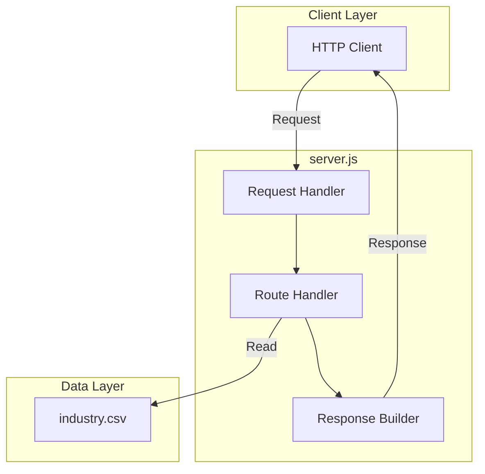
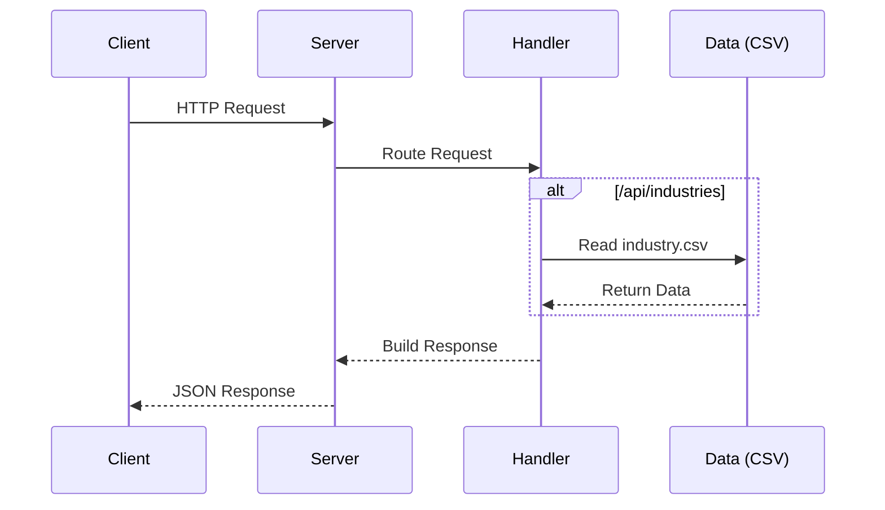

# hello_world


A lightweight Node.js HTTP server demonstrating RESTful API design with comprehensive JSDoc documentation.

---

## Table of Contents

- [Overview](#overview)
- [Features](#features)
- [Prerequisites](#prerequisites)
- [Installation](#installation)
- [Configuration](#configuration)
- [Usage](#usage)
- [API Reference](#api-reference)
  - [GET /](#get-)
  - [GET /health](#get-health)
  - [GET /api/industries](#get-apiindustries)
- [Deployment](#deployment)
- [Development](#development)
- [Project Structure](#project-structure)
- [Contributing](#contributing)
- [License](#license)

---

## Overview

**hello_world** is a Node.js HTTP server application that serves as both a functional API server and a documentation example project. It provides three RESTful endpoints for serving welcome messages, health status, and industry taxonomy data.

This project has a dual purpose:
1. **Functional Server**: A working HTTP server with REST API endpoints demonstrating Node.js best practices
2. **Documentation Example**: A showcase of comprehensive JSDoc documentation and project documentation standards

The server utilizes only Node.js built-in modules (`http`, `fs`, `path`) with no external dependencies, making it lightweight and easy to deploy.

### Architecture Overview



---

## Features

- **HTTP Server**: Built on Node.js core `http` module for minimal dependencies
- **REST API Endpoints**: Three well-documented endpoints following REST conventions
- **Health Check Endpoint**: Built-in health monitoring for load balancers and orchestrators
- **Industry Data API**: Serves industry taxonomy data from CSV data source
- **JSON Responses**: All endpoints return consistently formatted JSON responses
- **CORS Support**: Cross-Origin Resource Sharing enabled for browser-based clients
- **Graceful Shutdown**: Proper handling of SIGINT/SIGTERM signals for clean shutdowns
- **Comprehensive Documentation**: Full JSDoc annotations and inline code explanations
- **Zero Dependencies**: Uses only Node.js built-in modules

---

## Prerequisites

Before installing and running this project, ensure you have the following installed:

| Requirement | Minimum Version | Recommended Version | Purpose |
|-------------|-----------------|---------------------|---------|
| Node.js | v12.0.0 | v18.x LTS or later | JavaScript runtime |
| npm | v6.0.0 | v9.x or later | Package manager |
| Git | v2.0.0 | Latest | Version control |

### Verifying Prerequisites

```bash
# Check Node.js version
node --version
# Expected: v12.0.0 or higher

# Check npm version
npm --version
# Expected: v6.0.0 or higher

# Check Git version
git --version
# Expected: git version 2.x.x
```

---

## Installation

Follow these steps to set up the project locally:

### Step 1: Clone the Repository

```bash
git clone <repository-url>
cd hello_world
```

### Step 2: Install Dependencies

```bash
npm install
```

> **Note**: This project has minimal dependencies. The `npm install` command installs development dependencies like JSDoc for documentation generation.

### Step 3: Verify Installation

```bash
# Start the server to verify installation
npm start

# You should see output similar to:
# Server running at http://localhost:3000/
```

### Step 4: Test the Installation

In a new terminal window:

```bash
# Test the root endpoint
curl http://localhost:3000/

# Expected response:
# {
#   "success": true,
#   "message": "Welcome to hello_world API",
#   "version": "1.0.0",
#   ...
# }
```

---

## Configuration

The server can be configured using environment variables:

| Variable | Description | Default | Example |
|----------|-------------|---------|---------|
| `PORT` | Port number for the HTTP server | `3000` | `8080` |
| `HOST` | Hostname/IP address to bind to | `localhost` | `0.0.0.0` |
| `NODE_ENV` | Environment mode | `development` | `production` |

### Setting Environment Variables

#### Linux/macOS

```bash
# Set variables inline
PORT=8080 HOST=0.0.0.0 node server.js

# Or export for current session
export PORT=8080
export HOST=0.0.0.0
node server.js
```

#### Windows (Command Prompt)

```cmd
set PORT=8080
set HOST=0.0.0.0
node server.js
```

#### Windows (PowerShell)

```powershell
$env:PORT = "8080"
$env:HOST = "0.0.0.0"
node server.js
```

### Environment File (Optional)

Create a `.env` file in the project root (requires `dotenv` package):

```env
PORT=3000
HOST=localhost
NODE_ENV=development
```

---

## Usage

### Starting the Server

```bash
# Start the server (default: http://localhost:3000)
npm start

# Or run directly with node
node server.js

# Start with custom port
PORT=8080 npm start
```

### Running Tests

```bash
# Run test suite (placeholder - not yet implemented)
npm test
```

> **Note**: Test suite is not yet implemented. The command will exit with an error by design.

### Generating Documentation

```bash
# Generate JSDoc documentation
npm run docs

# Documentation will be generated in ./docs directory
# Open ./docs/index.html in a browser to view
```

### Stopping the Server

Press `Ctrl+C` to gracefully stop the server. The server handles SIGINT/SIGTERM signals for clean shutdown.

---

## API Reference

All endpoints return JSON responses with a consistent format:

```json
{
  "success": true|false,
  "message": "Human-readable message",
  "data": "Response data (format varies by endpoint)",
  "error": "Error message (only on failure)"
}
```

### Request Flow



---

### GET /

Returns a welcome message with API version and available endpoints documentation.

**Request**

```http
GET / HTTP/1.1
Host: localhost:3000
```

**Response**

| Status Code | Description |
|-------------|-------------|
| `200 OK` | Successful request |

**Response Body**

```json
{
  "success": true,
  "message": "Welcome to hello_world API",
  "version": "1.0.0",
  "endpoints": {
    "GET /": "This welcome message",
    "GET /health": "Health check endpoint",
    "GET /api/industries": "List of industry categories"
  }
}
```

**Example**

```bash
curl -X GET http://localhost:3000/
```

---

### GET /health

Returns the current health status, timestamp, and server uptime. Used by load balancers and monitoring systems to verify server availability.

**Request**

```http
GET /health HTTP/1.1
Host: localhost:3000
```

**Response**

| Status Code | Description |
|-------------|-------------|
| `200 OK` | Server is healthy |

**Response Body**

```json
{
  "success": true,
  "status": "ok",
  "timestamp": "2024-01-15T10:30:00.000Z",
  "uptime": 3600
}
```

**Response Fields**

| Field | Type | Description |
|-------|------|-------------|
| `success` | boolean | Always `true` for successful requests |
| `status` | string | Health status (`"ok"` when healthy) |
| `timestamp` | string | ISO 8601 formatted timestamp |
| `uptime` | number | Server uptime in seconds |

**Example**

```bash
curl -X GET http://localhost:3000/health
```

**Use Cases**

- Kubernetes liveness/readiness probes
- Load balancer health checks
- Monitoring system integration
- Service discovery health verification

---

### GET /api/industries

Returns a list of industry categories loaded from the `industry.csv` data file.

**Request**

```http
GET /api/industries HTTP/1.1
Host: localhost:3000
```

**Response**

| Status Code | Description |
|-------------|-------------|
| `200 OK` | Successful request |
| `500 Internal Server Error` | Failed to read data file |

**Success Response Body**

```json
{
  "success": true,
  "data": [
    "Accounting/Finance",
    "Advertising/Public Relations",
    "Aerospace/Aviation",
    "Arts/Entertainment/Publishing",
    "Automotive",
    "Banking/Mortgage",
    "Business Development",
    "Business Opportunity",
    "..."
  ],
  "count": 43
}
```

**Response Fields**

| Field | Type | Description |
|-------|------|-------------|
| `success` | boolean | Indicates if the request was successful |
| `data` | string[] | Array of industry category names |
| `count` | number | Total number of industries returned |

**Error Response Body**

```json
{
  "success": false,
  "error": "Failed to load industries data",
  "details": "ENOENT: no such file or directory"
}
```

**Example**

```bash
curl -X GET http://localhost:3000/api/industries
```

**Available Industries**

The endpoint returns 43 industry categories including:
- Accounting/Finance
- Advertising/Public Relations
- Healthcare
- Technology
- Manufacturing/Operations
- And 38 more...

---

## Deployment

### Production Environment Setup

1. **Configure Environment Variables**

   ```bash
   # Set production environment
   export NODE_ENV=production
   
   # Bind to all interfaces for external access
   export HOST=0.0.0.0
   
   # Set appropriate port (often 80 or behind reverse proxy)
   export PORT=3000
   ```

2. **Verify Data Files**

   Ensure `industry.csv` is present in the deployment directory:

   ```bash
   ls -la industry.csv
   ```

### Deployment Commands

#### Direct Deployment

```bash
# Start server in production mode
NODE_ENV=production HOST=0.0.0.0 PORT=3000 node server.js
```

#### Using Process Manager (PM2)

```bash
# Install PM2 globally
npm install -g pm2

# Start with PM2
pm2 start server.js --name hello_world

# View logs
pm2 logs hello_world

# Monitor
pm2 monit

# Stop
pm2 stop hello_world

# Restart
pm2 restart hello_world
```

#### Docker Deployment

Create a `Dockerfile`:

```dockerfile
FROM node:18-alpine

WORKDIR /app

COPY package*.json ./
RUN npm install --production

COPY . .

EXPOSE 3000

ENV NODE_ENV=production
ENV HOST=0.0.0.0
ENV PORT=3000

CMD ["node", "server.js"]
```

Build and run:

```bash
# Build image
docker build -t hello_world:1.0.0 .

# Run container
docker run -d -p 3000:3000 --name hello_world hello_world:1.0.0

# View logs
docker logs hello_world

# Stop container
docker stop hello_world
```

### Verification Procedures

After deployment, verify the server is running correctly:

```bash
# 1. Check root endpoint
curl http://your-server:3000/
# Expected: JSON with welcome message

# 2. Check health endpoint
curl http://your-server:3000/health
# Expected: {"success":true,"status":"ok",...}

# 3. Check API endpoint
curl http://your-server:3000/api/industries
# Expected: {"success":true,"data":[...],"count":43}

# 4. Verify error handling
curl http://your-server:3000/nonexistent
# Expected: 404 response with available endpoints
```

### Production Considerations

- **Reverse Proxy**: Use Nginx or Apache as a reverse proxy for SSL termination
- **Logging**: Configure proper logging for production monitoring
- **Security**: Restrict CORS origins in production by modifying `sendResponse()`
- **Scaling**: Use PM2 cluster mode or container orchestration for horizontal scaling
- **Monitoring**: Integrate with APM tools (New Relic, Datadog, etc.)

---

## Development

### Development Workflow

1. **Start Development Server**

   ```bash
   # Start server with auto-restart on changes (requires nodemon)
   npx nodemon server.js
   
   # Or standard start
   npm start
   ```

2. **Test Changes**

   ```bash
   # Test endpoints manually
   curl http://localhost:3000/
   curl http://localhost:3000/health
   curl http://localhost:3000/api/industries
   ```

3. **Generate Documentation**

   ```bash
   # Generate JSDoc documentation
   npm run docs
   
   # View generated docs
   open docs/index.html
   ```

### Code Style and Conventions

- **JavaScript**: ES6+ syntax with `'use strict'` directive
- **Comments**: JSDoc annotations for all functions
- **Naming**: camelCase for functions/variables, UPPER_CASE for constants
- **Formatting**: Consistent indentation (4 spaces)

### JSDoc Conventions

All functions should include JSDoc comments following this pattern:

```javascript
/**
 * Brief description of the function.
 * Additional details if necessary.
 *
 * @function functionName
 * @param {Type} paramName - Description of parameter
 * @returns {Type} Description of return value
 * @throws {Error} Description of when errors are thrown
 * @example
 * // Example usage
 * functionName(arg1, arg2);
 */
```

### Testing Approach

Currently, the test suite is a placeholder. Future testing should include:

- **Unit Tests**: Test individual functions with mock request/response objects
- **Integration Tests**: Test full request/response cycles
- **Endpoint Tests**: Verify all API endpoints return expected responses

---

## Project Structure

```
hello_world/
├── server.js           # Main HTTP server implementation with JSDoc comments
├── package.json        # npm package configuration and scripts
├── package-lock.json   # Dependency lock file for reproducible installs
├── jsdoc.json          # JSDoc configuration for documentation generation
├── README.md           # This documentation file
├── industry.csv        # Industry taxonomy data (43 categories)
├── LoginTest.java      # Java placeholder file (test fixture)
├── sample.doc          # Sample document file
└── docs/               # Generated JSDoc documentation (after npm run docs)
    └── index.html      # Documentation entry point
```

### File Descriptions

| File | Purpose |
|------|---------|
| `server.js` | Main HTTP server implementation with three endpoints (/, /health, /api/industries). Contains comprehensive JSDoc documentation for all functions. |
| `package.json` | npm package manifest defining project metadata, scripts (`start`, `docs`, `test`), and development dependencies. |
| `package-lock.json` | Auto-generated lock file ensuring reproducible dependency installation. |
| `jsdoc.json` | Configuration for JSDoc documentation generator. Specifies source files, output directory, and template settings. |
| `README.md` | Comprehensive project documentation including setup, API reference, and deployment guides. |
| `industry.csv` | Single-column CSV file containing 43 industry category names used by the /api/industries endpoint. |
| `LoginTest.java` | Java placeholder file serving as a test fixture (intentionally non-functional). |
| `sample.doc` | Sample document file for testing purposes. |

---

## Contributing

We welcome contributions to the hello_world project! Please follow these guidelines:

### How to Contribute

1. **Fork the Repository**

   Click the "Fork" button on GitHub to create your own copy.

2. **Clone Your Fork**

   ```bash
   git clone https://github.com/your-username/hello_world.git
   cd hello_world
   ```

3. **Create a Feature Branch**

   ```bash
   git checkout -b feature/your-feature-name
   ```

4. **Make Changes**

   - Follow existing code style and conventions
   - Add JSDoc comments for new functions
   - Update README if adding new features

5. **Test Your Changes**

   ```bash
   npm start
   # Test all endpoints manually
   ```

6. **Commit Your Changes**

   ```bash
   git add .
   git commit -m "feat: add your feature description"
   ```

7. **Push and Create Pull Request**

   ```bash
   git push origin feature/your-feature-name
   ```

   Then create a Pull Request on GitHub.

### Code Guidelines

- Maintain the existing code style
- Add JSDoc documentation for all new functions
- Test changes before submitting
- Keep commits focused and atomic
- Write clear commit messages

### Reporting Issues

- Use GitHub Issues for bug reports and feature requests
- Include steps to reproduce for bugs
- Provide context and expected behavior

---

## License

This project is licensed under the **MIT License**.

```
MIT License

Copyright (c) 2024 hxu

Permission is hereby granted, free of charge, to any person obtaining a copy
of this software and associated documentation files (the "Software"), to deal
in the Software without restriction, including without limitation the rights
to use, copy, modify, merge, publish, distribute, sublicense, and/or sell
copies of the Software, and to permit persons to whom the Software is
furnished to do so, subject to the following conditions:

The above copyright notice and this permission notice shall be included in all
copies or substantial portions of the Software.

THE SOFTWARE IS PROVIDED "AS IS", WITHOUT WARRANTY OF ANY KIND, EXPRESS OR
IMPLIED, INCLUDING BUT NOT LIMITED TO THE WARRANTIES OF MERCHANTABILITY,
FITNESS FOR A PARTICULAR PURPOSE AND NONINFRINGEMENT. IN NO EVENT SHALL THE
AUTHORS OR COPYRIGHT HOLDERS BE LIABLE FOR ANY CLAIM, DAMAGES OR OTHER
LIABILITY, WHETHER IN AN ACTION OF CONTRACT, TORT OR OTHERWISE, ARISING FROM,
OUT OF OR IN CONNECTION WITH THE SOFTWARE OR THE USE OR OTHER DEALINGS IN THE
SOFTWARE.
```

See [package.json](./package.json) for license declaration.

---

<p align="center">
  <strong>hello_world</strong> v1.0.0 | Created by hxu | MIT License
</p>
