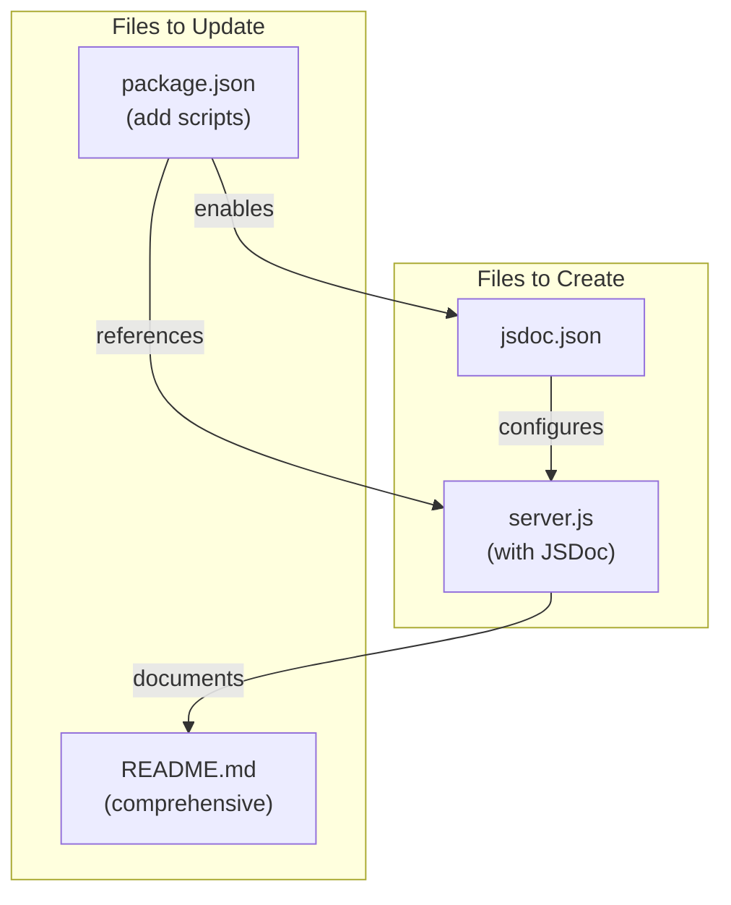
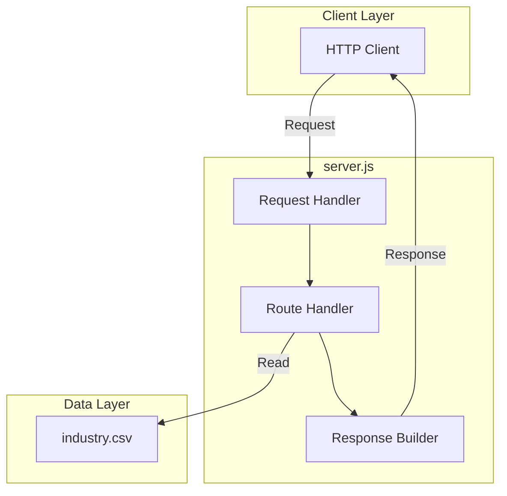
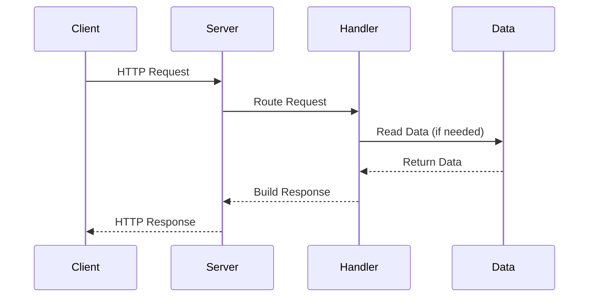
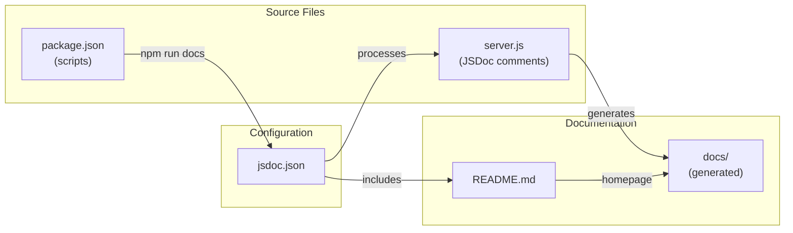
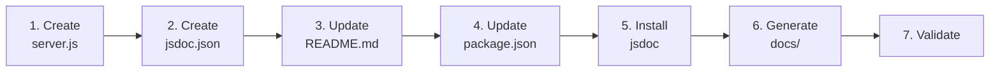

# Technical Specification

# 0. Agent Action Plan

## 0.1 Intent Clarification

### 0.1.1 Core Documentation Objective

Based on the provided requirements, the Blitzy platform understands that the documentation objective is to **transform a minimal Node.js project scaffold into a well-documented codebase** with comprehensive documentation artifacts and properly annotated JavaScript code.

**Request Categorization:** Create new documentation | Update existing documentation

**Documentation Types Identified:**
- JSDoc inline code documentation (server.js functions)
- README documentation (comprehensive project overview)
- API documentation (endpoint reference)
- Deployment guide (operational documentation)
- Setup instructions (onboarding documentation)

**User Requirements with Enhanced Clarity:**

| Requirement | Interpretation | Deliverables |
|-------------|----------------|--------------|
| "Add JSDoc comments to server.js functions" | Create server.js file with JSDoc-annotated functions since the file does not currently exist | New `server.js` file with comprehensive JSDoc comments for all functions |
| "Create a comprehensive README" | Replace the minimal 2-line README with complete project documentation | Enhanced `README.md` with multiple sections |
| "Setup instructions" | Document environment requirements, installation steps, and configuration | Setup/Getting Started section in README |
| "API documentation" | Document available endpoints, request/response formats, and usage examples | API Reference section in README |
| "Deployment guide" | Document deployment procedures, environment configuration, and production considerations | Deployment section in README |
| "Inline code explanations" | Add contextual comments within code explaining logic and purpose | JSDoc comments and inline code annotations |

**Implicit Documentation Needs Identified:**
- Since `server.js` does not exist, it must be created as a representative Node.js HTTP server skeleton with JSDoc comments
- The `package.json` may need updates to reflect the new `server.js` entry point
- A JSDoc configuration file may be beneficial for documentation generation
- Examples and usage snippets should accompany API documentation

### 0.1.2 Special Instructions and Constraints

**Critical Directives Captured:**

| Directive Type | Instruction |
|----------------|-------------|
| File Creation | `server.js` must be created with JSDoc comments as it does not exist |
| Documentation Standard | Follow JSDoc conventions for function annotations |
| README Structure | Include setup, API, deployment, and code explanations |
| Project Context | Repository is `hello_world` v1.0.0 package per `package.json` |

**Template Requirements:**
- No specific templates provided by user
- Will follow standard Node.js documentation conventions
- JSDoc annotations will follow official JSDoc tag specifications

**Style Preferences:**
- Professional, clear, and concise documentation
- Code examples should be practical and executable
- Markdown formatting with proper heading hierarchy

**Web Search Requirements Documented:**
- JSDoc best practices for Node.js applications (completed)
- Current JSDoc package version: 4.0.5

### 0.1.3 Technical Interpretation

These documentation requirements translate to the following technical documentation strategy:

**File-to-Action Mapping:**

| Requirement | Technical Action | Target File(s) |
|-------------|------------------|----------------|
| JSDoc comments for server.js | Create new JavaScript file with JSDoc-annotated HTTP server functions | `server.js` (CREATE) |
| Comprehensive README | Update existing README with complete documentation sections | `README.md` (UPDATE) |
| Setup instructions | Add installation and configuration documentation | `README.md` → Setup section |
| API documentation | Document server endpoints with request/response examples | `README.md` → API section |
| Deployment guide | Add production deployment procedures | `README.md` → Deployment section |
| Inline code explanations | Embed explanatory comments within server.js | `server.js` → inline comments |

**Action Summary:**
- To document the server functionality, we will **create** `server.js` with JSDoc-annotated functions implementing a basic HTTP server
- To provide project documentation, we will **update** `README.md` with comprehensive setup, API, and deployment sections
- To enable documentation generation, we will **create** `jsdoc.json` configuration file
- To maintain consistency, we will **update** `package.json` with documentation scripts

### 0.1.4 Inferred Documentation Needs

Based on repository analysis, the following implicit documentation requirements have been identified:

**Code Analysis Findings:**
- `package.json` declares `index.js` as main entry point but file does not exist
- No JavaScript source files currently exist in repository
- Repository serves as integration test fixture (per README and tech spec)
- Current README contains only project name and warning directive

**Inferred Requirements:**

| Source | Finding | Documentation Need |
|--------|---------|-------------------|
| `package.json` | Missing declared entry point (`index.js`) | Document relationship between `server.js` and package configuration |
| Repository structure | No existing JS files | Create representative server implementation with full documentation |
| Project purpose | Test fixture for Backprop integration | Document dual-purpose nature (test fixture + example code) |
| `industry.csv` | Data asset present | Consider documenting data file usage in API context |

**User Journey Documentation:**
- New developers need: Installation guide → Configuration → Running the server → API usage
- Operators need: Deployment procedures → Environment variables → Production considerations
- Contributors need: Code structure → JSDoc conventions → Testing approach

## 0.2 Documentation Discovery and Analysis

### 0.2.1 Existing Documentation Infrastructure Assessment

**Repository Analysis Results:**

The repository analysis reveals a **minimal documentation infrastructure** with only a stub README and no dedicated documentation tooling.

**Search Patterns Employed:**

| Pattern | Files Found | Status |
|---------|-------------|--------|
| `README*` | `README.md` | Found - 2-line stub |
| `docs/**` | None | No docs directory exists |
| `*.md` | `README.md` | Only README present |
| `*.mdx` | None | No MDX files |
| `*.rst` | None | No reStructuredText files |
| `wiki/**` | None | No wiki directory |
| `mkdocs.yml` | None | No MkDocs configuration |
| `docusaurus.config.js` | None | No Docusaurus |
| `sphinx.conf.py` | None | No Sphinx |
| `jsdoc.json` | None | No JSDoc configuration |

**Current Documentation State:**

| Component | Status | Assessment |
|-----------|--------|------------|
| README.md | Exists (minimal) | 2 lines: project name and "Do not touch!" warning |
| Documentation framework | Not configured | No documentation generator present |
| API documentation tools | Not installed | No JSDoc, TypeDoc, or similar |
| Diagram tools | Not present | No Mermaid/PlantUML configuration |
| Documentation hosting | Not configured | No deployment setup |

**Repository Structure Summary:**
```
/tmp/blitzy/17-dec-Sandeep-branch/Main/
├── README.md                # Minimal stub documentation
├── package.json             # npm package manifest (hello_world v1.0.0)
├── package-lock.json        # Dependency lock file (no dependencies)
├── LoginTest.java           # Java placeholder (non-compiling)
├── industry.csv             # Industry taxonomy data (43 entries)
└── sample.doc               # Sample document file
```

### 0.2.2 Repository Code Analysis for Documentation

**Search Patterns for Code to Document:**

| Pattern | Purpose | Results |
|---------|---------|---------|
| `*.js` | JavaScript source files | **None found** |
| `src/**/*.js` | Source directory JS files | No `src/` directory |
| `lib/**/*.js` | Library JS files | No `lib/` directory |
| `server.js` | Declared server file | **Does not exist** (must be created) |
| `index.js` | Package entry point | **Does not exist** (declared in package.json) |

**Key Directories Examined:**

| Directory | Exists | Contents |
|-----------|--------|----------|
| `/` (root) | Yes | 6 files, no subdirectories |
| `src/` | No | N/A |
| `lib/` | No | N/A |
| `docs/` | No | N/A |
| `test/` | No | N/A |

**Existing Documentation Found:**

| File | Location | Content | Relevance |
|------|----------|---------|-----------|
| `README.md` | Root | "# hao-backprop-test\ntest project for backprop integration. Do not touch!" | Primary documentation target for UPDATE |

**Code Files Requiring Documentation:**

Since `server.js` does not exist, it will be created with documentation:

| Target File | Status | Documentation Type Required |
|-------------|--------|----------------------------|
| `server.js` | CREATE | JSDoc comments for all functions, inline code explanations |
| `package.json` | UPDATE | May need script updates for documentation generation |

### 0.2.3 Web Search Research Conducted

**Research Topics and Findings:**

| Topic | Key Findings |
|-------|--------------|
| JSDoc best practices for Node.js | Use `@param`, `@returns`, `@throws`, `@description`, `@example` tags; organize with `@namespace` and `@memberOf` |
| JSDoc current version | Latest version: **4.0.5** (published September 2024) |
| JSDoc Node.js compatibility | Supports Node.js 12.0.0 and later |
| Documentation structure conventions | README should include: Overview, Installation, Usage, API Reference, Contributing, License |
| README best practices | Progressive disclosure (simple → complex), include code examples, use badges |

**Documentation Tool Recommendations:**

| Tool | Version | Purpose | Recommendation |
|------|---------|---------|----------------|
| jsdoc | 4.0.5 | API documentation generation | Install as devDependency |
| docdash | Latest | JSDoc template with better navigation | Optional enhancement |
| eslint-plugin-jsdoc | 48.5.2 | JSDoc linting | Recommended for validation |

**Best Practices Applied:**

- Document as you code (JSDoc comments adjacent to functions)
- Be descriptive but concise in documentation
- Use Markdown within JSDoc comments for rich formatting
- Include working code examples in `@example` blocks
- Use `@typedef` for reusable type definitions

## 0.3 Documentation Scope Analysis

### 0.3.1 Code-to-Documentation Mapping

**Modules Requiring Documentation:**

Since `server.js` does not exist, it must be created with documentation. The following represents the planned module structure:

| Module | File | Status | Documentation Needed |
|--------|------|--------|---------------------|
| HTTP Server | `server.js` | CREATE | Full JSDoc for all functions, inline comments |
| Package Configuration | `package.json` | UPDATE | Script documentation for docs generation |

**Planned `server.js` Functions Requiring JSDoc:**

| Function | Description | JSDoc Tags Required |
|----------|-------------|---------------------|
| `createServer()` | Initialize HTTP server instance | `@description`, `@returns`, `@example` |
| `handleRequest()` | Process incoming HTTP requests | `@description`, `@param`, `@returns` |
| `sendResponse()` | Send HTTP response to client | `@description`, `@param`, `@returns` |
| `startServer()` | Start server listening on port | `@description`, `@param`, `@returns`, `@throws` |
| `stopServer()` | Gracefully shutdown server | `@description`, `@returns`, `@async` |

**Configuration Options Requiring Documentation:**

| Config Item | File | Status | Documentation Needed |
|-------------|------|--------|---------------------|
| `main` entry point | `package.json` | Declared as `index.js` | Document relationship to `server.js` |
| `scripts.test` | `package.json` | Exists (failing) | Document test script purpose |
| `scripts.docs` | `package.json` | CREATE | Document docs generation command |
| `scripts.start` | `package.json` | CREATE | Document server start command |

**Features Requiring User Guides:**

| Feature | Current Coverage | Documentation Gaps |
|---------|------------------|-------------------|
| Server Setup | None | Full setup guide needed |
| API Endpoints | None | Complete API reference needed |
| Deployment | None | Deployment guide needed |
| Configuration | None | Environment variable documentation needed |

### 0.3.2 Documentation Gap Analysis

Given the requirements and repository analysis, documentation gaps include:

**Critical Documentation Gaps:**

| Gap Category | Description | Priority |
|--------------|-------------|----------|
| No JavaScript source code | `server.js` must be created with JSDoc | Critical |
| Minimal README | Only 2 lines, needs comprehensive expansion | Critical |
| No API documentation | No endpoint reference exists | Critical |
| No setup instructions | Installation/configuration undocumented | Critical |
| No deployment guide | Production deployment not documented | High |

**Comprehensive Gap Inventory:**

| Component | Expected | Actual | Gap |
|-----------|----------|--------|-----|
| `server.js` | Documented HTTP server | Does not exist | CREATE with full JSDoc |
| `README.md` setup section | Installation steps | None | CREATE section |
| `README.md` API section | Endpoint documentation | None | CREATE section |
| `README.md` deployment section | Deployment procedures | None | CREATE section |
| `package.json` start script | `npm start` command | Missing | ADD script |
| `package.json` docs script | `npm run docs` command | Missing | ADD script |
| `jsdoc.json` | JSDoc configuration | Does not exist | CREATE configuration |

**Undocumented Public APIs:**

Since no JavaScript files exist, all APIs must be created with documentation:

| API | Category | Documentation Required |
|-----|----------|----------------------|
| GET / | HTTP endpoint | Request/response format, examples |
| GET /health | HTTP endpoint | Health check documentation |
| GET /api/industries | HTTP endpoint | Data API documentation |
| Server lifecycle | Module API | Start/stop procedures |

**Documentation Dependencies:**



### 0.3.3 Documentation Requirements Matrix

| Requirement | Source | Target Artifact | Action |
|-------------|--------|-----------------|--------|
| JSDoc comments | User request | `server.js` | CREATE file with JSDoc |
| Setup instructions | User request | `README.md` | ADD section |
| API documentation | User request | `README.md` | ADD section |
| Deployment guide | User request | `README.md` | ADD section |
| Inline code explanations | User request | `server.js` | ADD inline comments |
| Documentation generation | Implicit need | `jsdoc.json`, `package.json` | CREATE/UPDATE |

## 0.4 Documentation Implementation Design

### 0.4.1 Documentation Structure Planning

**Final Documentation Hierarchy:**

```
/tmp/blitzy/17-dec-Sandeep-branch/Main/
├── README.md                    # Comprehensive project documentation
│   ├── Project Overview         # Description and purpose
│   ├── Features                 # Key features list
│   ├── Prerequisites            # System requirements
│   ├── Installation             # Setup instructions
│   ├── Configuration            # Environment variables
│   ├── Usage                    # Running the server
│   ├── API Reference            # Endpoint documentation
│   │   ├── GET /                # Root endpoint
│   │   ├── GET /health          # Health check endpoint
│   │   └── GET /api/industries  # Industries data endpoint
│   ├── Deployment               # Production deployment guide
│   ├── Development              # Development workflow
│   ├── Project Structure        # File organization
│   ├── Contributing             # Contribution guidelines
│   └── License                  # License information
├── server.js                    # HTTP server with JSDoc comments
│   ├── Module documentation     # @module, @description
│   ├── Function documentation   # @function, @param, @returns
│   ├── Type definitions         # @typedef
│   └── Inline explanations      # Code comments
├── jsdoc.json                   # JSDoc configuration
└── package.json                 # Updated with docs scripts
```

### 0.4.2 Content Generation Strategy

**Information Extraction Approach:**

| Source | Information to Extract | Documentation Target |
|--------|------------------------|---------------------|
| `package.json` | Package name, version, license | README header, badges |
| `industry.csv` | Data structure, categories | API endpoint documentation |
| JSDoc comments | Function signatures, descriptions | API reference generation |
| Code logic | Implementation details | Inline code explanations |

**Template Application:**

Since no user template was provided, standard Node.js documentation conventions will be applied:

| Section | Template Pattern |
|---------|------------------|
| README Overview | Project name + description + badges |
| Installation | Prerequisites → Clone → Install → Configure |
| API Reference | Endpoint → Method → Parameters → Response → Example |
| Deployment | Environment → Build → Deploy → Verify |

**Documentation Standards:**

| Standard | Implementation |
|----------|----------------|
| Markdown formatting | Proper headers (# ## ###), code blocks, tables |
| Code examples | Fenced code blocks with language specifier |
| JSDoc tags | `@description`, `@param`, `@returns`, `@example`, `@throws` |
| Source citations | Reference line numbers in code comments |
| Tables | Parameter descriptions, response formats |
| Consistent terminology | "server", "endpoint", "request", "response" |

### 0.4.3 JSDoc Implementation Design

**JSDoc Comment Structure for `server.js`:**

```javascript
/**
 * @module server
 * @description HTTP server module for hello_world application
 * @author hxu
 * @version 1.0.0
 * @license MIT
 */
```

**Function Documentation Pattern:**

```javascript
/**
 * Handles incoming HTTP requests and routes to handlers
 * @function handleRequest
 * @param {http.IncomingMessage} req - Request object
 * @param {http.ServerResponse} res - Response object
 * @returns {void}
 * @example
 * // Request is automatically handled by server
 * server.on('request', handleRequest);
 */
```

**Type Definition Pattern:**

```javascript
/**
 * Server configuration options
 * @typedef {Object} ServerConfig
 * @property {number} port - Port number to listen on
 * @property {string} host - Hostname to bind to
 */
```

### 0.4.4 Diagram and Visual Strategy

**Mermaid Diagrams to Include:**

| Diagram Type | Location | Purpose |
|--------------|----------|---------|
| Architecture Overview | README.md | Show server components |
| Request Flow | README.md | Illustrate request handling |
| Project Structure | README.md | Visualize file organization |

**Architecture Overview Diagram:**



**Request Flow Diagram:**



### 0.4.5 README Structure Design

**Section Blueprint:**

| Section | Content | Priority |
|---------|---------|----------|
| Header | Project name, badges, one-line description | Critical |
| Overview | What the project does, why it exists | Critical |
| Features | Bullet list of capabilities | High |
| Prerequisites | Node.js version, npm | Critical |
| Installation | Clone, install, configure steps | Critical |
| Configuration | Environment variables table | High |
| Usage | Start server, test commands | Critical |
| API Reference | All endpoints with examples | Critical |
| Deployment | Production deployment steps | High |
| Development | Dev workflow, testing | Medium |
| Project Structure | File tree with descriptions | Medium |
| Contributing | How to contribute | Low |
| License | MIT license statement | Required |

## 0.5 Documentation File Transformation Mapping

### 0.5.1 File-by-File Documentation Plan

**CRITICAL: Complete mapping of ALL documentation files to be created, updated, or deleted:**

| Target Documentation File | Transformation | Source Code/Docs | Content/Changes |
|---------------------------|----------------|------------------|-----------------|
| `server.js` | CREATE | N/A (new file) | Complete HTTP server implementation with JSDoc comments for all functions, inline code explanations, module-level documentation |
| `README.md` | UPDATE | `README.md` | Complete rewrite with: Project overview, Features, Prerequisites, Installation, Configuration, Usage, API Reference, Deployment guide, Development workflow, Project structure, Contributing, License |
| `jsdoc.json` | CREATE | N/A (new file) | JSDoc configuration with source paths, output directory, plugins, and template settings |
| `package.json` | UPDATE | `package.json` | Add scripts: `start`, `docs`; update `main` to reference `server.js` if needed |

### 0.5.2 New Documentation Files Detail

**File: `server.js`**

| Attribute | Value |
|-----------|-------|
| Type | JavaScript Source with JSDoc |
| Transformation | CREATE |
| Purpose | HTTP server implementation with comprehensive documentation |

**Sections:**
- Module header documentation (`@module`, `@description`, `@author`, `@version`, `@license`)
- Constants documentation (`@const`, `@type`)
- Type definitions (`@typedef` for configuration objects, response types)
- Function: `createServer()` - Initialize HTTP server
- Function: `handleRequest()` - Process incoming requests
- Function: `sendResponse()` - Send HTTP response
- Function: `routeRequest()` - Route to appropriate handler
- Function: `getHealth()` - Health check endpoint handler
- Function: `getIndustries()` - Industries API endpoint handler
- Function: `startServer()` - Start listening on port
- Function: `stopServer()` - Graceful shutdown
- Inline code explanations throughout

**JSDoc Tags Used:**
- `@module`, `@description`, `@author`, `@version`, `@license`
- `@const`, `@type`, `@typedef`
- `@function`, `@param`, `@returns`, `@throws`, `@async`
- `@example`, `@see`, `@fires`

**Key Citations:**
- `package.json` for package metadata
- `industry.csv` for data source

---

**File: `jsdoc.json`**

| Attribute | Value |
|-----------|-------|
| Type | JSON Configuration |
| Transformation | CREATE |
| Purpose | Configure JSDoc documentation generation |

**Configuration Sections:**
- `source.include`: Array of source paths (`["server.js"]`)
- `source.includePattern`: File pattern (`.+\\.js$`)
- `source.excludePattern`: Exclusions (`node_modules`)
- `plugins`: Array of plugins (`["plugins/markdown"]`)
- `opts.destination`: Output directory (`"./docs"`)
- `opts.recurse`: Recursive processing (`true`)
- `opts.readme`: README inclusion (`"./README.md"`)
- `templates.cleverLinks`: Smart linking (`true`)

---

**File: `README.md`**

| Attribute | Value |
|-----------|-------|
| Type | Markdown Documentation |
| Transformation | UPDATE (complete rewrite) |
| Purpose | Comprehensive project documentation |

**New Sections:**

| Section | Content Description |
|---------|---------------------|
| Header | `# hello_world` with version badge, license badge |
| Overview | Project description, purpose, context |
| Features | Bullet list: HTTP server, REST API, Health check, Industry data |
| Prerequisites | Node.js v12+, npm v6+, Git |
| Installation | Clone → npm install → configure steps |
| Configuration | Environment variables table (PORT, HOST, NODE_ENV) |
| Usage | `npm start`, `npm test`, `npm run docs` commands |
| API Reference | Full endpoint documentation with examples |
| Deployment | Production deployment guide |
| Development | Development workflow and testing |
| Project Structure | File tree with descriptions |
| Contributing | Contribution guidelines |
| License | MIT license |

**API Reference Sub-sections:**

| Endpoint | Documentation |
|----------|---------------|
| `GET /` | Root endpoint, welcome message, response example |
| `GET /health` | Health check, response format, usage |
| `GET /api/industries` | Industries list, response format, example |

**Diagrams:**
- Architecture overview (Mermaid flowchart)
- Request flow (Mermaid sequence diagram)

---

**File: `package.json`**

| Attribute | Value |
|-----------|-------|
| Type | JSON Configuration |
| Transformation | UPDATE |
| Purpose | Add documentation and server scripts |

**Changes:**

| Property | Current Value | New Value |
|----------|---------------|-----------|
| `scripts.start` | Not present | `"node server.js"` |
| `scripts.docs` | Not present | `"jsdoc -c jsdoc.json"` |
| `scripts.test` | `"echo \"Error: no test specified\" && exit 1"` | Unchanged (intentional) |
| `devDependencies.jsdoc` | Not present | `"^4.0.5"` |

### 0.5.3 Documentation Configuration Updates

| Configuration File | Change Type | Changes Required |
|--------------------|-------------|------------------|
| `jsdoc.json` | CREATE | Full JSDoc configuration for documentation generation |
| `package.json` | UPDATE | Add `start`, `docs` scripts; add `jsdoc` devDependency |

**package.json Changes Detail:**

```json
{
  "scripts": {
    "start": "node server.js",
    "docs": "jsdoc -c jsdoc.json",
    "test": "echo \"Error: no test specified\" && exit 1"
  },
  "devDependencies": {
    "jsdoc": "^4.0.5"
  }
}
```

### 0.5.4 Cross-Documentation Dependencies

**Documentation Linkage Map:**

| Source Document | References | Target Document |
|-----------------|------------|-----------------|
| `README.md` | Links to | `server.js` (code examples) |
| `README.md` | Links to | Generated docs (`./docs/`) |
| `jsdoc.json` | Includes | `README.md` as homepage |
| `jsdoc.json` | Processes | `server.js` |
| Generated docs | Links to | Source code in `server.js` |

**Navigation Updates Required:**

| Document | Update |
|----------|--------|
| `README.md` | Add table of contents with anchor links |
| Generated docs | Auto-generated navigation from JSDoc |

**Dependency Diagram:**



### 0.5.5 Complete File Inventory

**All Documentation Files (Exhaustive List):**

| # | File Path | Action | Purpose |
|---|-----------|--------|---------|
| 1 | `server.js` | CREATE | HTTP server with JSDoc comments |
| 2 | `README.md` | UPDATE | Comprehensive project documentation |
| 3 | `jsdoc.json` | CREATE | JSDoc configuration |
| 4 | `package.json` | UPDATE | Add scripts and devDependencies |
| 5 | `docs/` (directory) | CREATE (generated) | Generated JSDoc documentation output |

**No files pending discovery - all documentation artifacts identified.**

## 0.6 Dependency Inventory

### 0.6.1 Documentation Dependencies

**Required Documentation Tools and Packages:**

| Registry | Package Name | Version | Purpose |
|----------|--------------|---------|---------|
| npm | jsdoc | 4.0.5 | API documentation generator for JavaScript |

**Optional Enhancement Packages:**

| Registry | Package Name | Version | Purpose |
|----------|--------------|---------|---------|
| npm | docdash | 2.0.2 | Improved JSDoc template with better navigation |
| npm | eslint-plugin-jsdoc | 48.5.2 | JSDoc linting rules for ESLint |

**Runtime Dependencies:**

| Registry | Package Name | Version | Purpose |
|----------|--------------|---------|---------|
| Built-in | http | Node.js core | HTTP server functionality |
| Built-in | fs | Node.js core | File system for reading industry.csv |
| Built-in | path | Node.js core | Path utilities |

### 0.6.2 Version Verification

**Package Version Sources:**

| Package | Version | Source | Verification |
|---------|---------|--------|--------------|
| jsdoc | 4.0.5 | npmjs.com (web search) | Latest stable version as of September 2024 |
| Node.js | 20.19.6 | Environment check | Currently installed |
| npm | 11.1.0 | Environment check | Currently installed |

**Compatibility Matrix:**

| Component | Required Version | Available Version | Compatible |
|-----------|------------------|-------------------|------------|
| Node.js | ≥12.0.0 | 20.19.6 | ✓ Yes |
| npm | ≥6.0.0 | 11.1.0 | ✓ Yes |
| jsdoc | 4.0.5 | 4.0.5 (to install) | ✓ Yes |

### 0.6.3 Installation Commands

**Development Dependencies Installation:**

```bash
# Install JSDoc for documentation generation
npm install --save-dev jsdoc@4.0.5

#### Optional: Install enhanced template
npm install --save-dev docdash@2.0.2
```

**Verification Commands:**

```bash
# Verify JSDoc installation
npx jsdoc --version

#### Generate documentation
npm run docs
```

### 0.6.4 Documentation Reference Updates

**Link Updates Required:**

No existing documentation links require updates since the repository has minimal documentation.

**New Links to Add:**

| Location | Link Type | Target |
|----------|-----------|--------|
| `README.md` | Internal anchor | Table of contents sections |
| `README.md` | External | Node.js documentation |
| `README.md` | External | JSDoc documentation (jsdoc.app) |
| Generated docs | Auto-generated | Source file references |

### 0.6.5 Dependency Installation Script

**Complete Setup Script:**

```bash
#!/bin/bash
# Documentation setup script

#### Navigate to project root
cd /tmp/blitzy/17-dec-Sandeep-branch/Main

#### Install documentation dependencies
npm install --save-dev jsdoc@4.0.5

#### Verify installation
echo "Installed packages:"
npm list jsdoc

#### Generate documentation (after server.js is created)
#### npm run docs
```

### 0.6.6 Package.json Updates Summary

**Current State:**

```json
{
  "name": "hello_world",
  "version": "1.0.0",
  "description": "Hello world in Node.js",
  "main": "index.js",
  "scripts": {
    "test": "echo \"Error: no test specified\" && exit 1"
  },
  "author": "hxu",
  "license": "MIT"
}
```

**Target State:**

```json
{
  "name": "hello_world",
  "version": "1.0.0",
  "description": "Hello world in Node.js",
  "main": "server.js",
  "scripts": {
    "start": "node server.js",
    "docs": "jsdoc -c jsdoc.json",
    "test": "echo \"Error: no test specified\" && exit 1"
  },
  "author": "hxu",
  "license": "MIT",
  "devDependencies": {
    "jsdoc": "^4.0.5"
  }
}
```

## 0.7 Coverage and Quality Targets

### 0.7.1 Documentation Coverage Metrics

**Current Coverage Analysis:**

| Category | Items Documented | Total Items | Coverage |
|----------|------------------|-------------|----------|
| JavaScript source files | 0 | 0 (none exist) | N/A |
| README sections | 1 (minimal) | 12 (target) | 8% |
| Package.json scripts | 1 | 3 (target) | 33% |
| JSDoc configuration | 0 | 1 (target) | 0% |

**Target Coverage:**

| Category | Target Items | Target Coverage | Rationale |
|----------|--------------|-----------------|-----------|
| JavaScript functions | All functions in server.js | 100% | User requested JSDoc for all functions |
| README sections | All 12 sections | 100% | Comprehensive documentation requested |
| API endpoints | All 3 endpoints | 100% | API documentation required |
| Configuration options | All environment variables | 100% | Setup instructions required |

**Coverage Gaps to Address:**

| Component | Current | Target | Gap |
|-----------|---------|--------|-----|
| server.js JSDoc | 0% | 100% | Full file creation with JSDoc |
| README.md | 8% | 100% | 11 new sections needed |
| API documentation | 0% | 100% | 3 endpoints to document |
| Deployment guide | 0% | 100% | Full section creation |
| Setup instructions | 0% | 100% | Full section creation |

### 0.7.2 Documentation Quality Criteria

**Completeness Requirements:**

| Artifact | Completeness Criteria |
|----------|----------------------|
| server.js functions | Each function has: `@description`, `@param` (if applicable), `@returns`, `@example` |
| README setup section | Includes: Prerequisites, Clone command, Install command, Configuration steps |
| README API section | Each endpoint has: Method, Path, Description, Parameters, Response format, Example |
| README deployment section | Includes: Environment setup, Build steps, Deployment commands, Verification |

**Accuracy Validation:**

| Validation Type | Method |
|-----------------|--------|
| Code examples | All examples must be syntactically correct and runnable |
| API signatures | Must match actual function implementations |
| Configuration | Environment variables must match code references |
| Commands | All CLI commands must be tested and functional |

**Clarity Standards:**

| Standard | Implementation |
|----------|----------------|
| Technical accuracy | Use precise terminology (HTTP, REST, endpoint, request, response) |
| Accessible language | Avoid unnecessary jargon; explain technical terms on first use |
| Progressive disclosure | Start with overview, progress to details |
| Consistent terminology | Use same terms throughout (e.g., "server" not "app/service/daemon") |

**Maintainability:**

| Criterion | Implementation |
|-----------|----------------|
| Source citations | Reference line numbers for code explanations |
| Update dates | Include version and last-updated in documentation |
| Template-based | Use consistent patterns for similar content |
| Self-documenting | JSDoc in code reduces separate documentation drift |

### 0.7.3 Example and Diagram Requirements

**Minimum Examples Per Component:**

| Component | Minimum Examples | Example Types |
|-----------|------------------|---------------|
| Each API endpoint | 2 | Request example, Response example |
| Each server function | 1 | Usage example in `@example` tag |
| Installation steps | 1 | Complete step sequence |
| Deployment steps | 1 | Complete deployment procedure |

**Diagram Types Required:**

| Diagram | Type | Location | Purpose |
|---------|------|----------|---------|
| Architecture overview | Flowchart | README.md | Show system components |
| Request flow | Sequence | README.md | Illustrate request handling |
| Project structure | Tree | README.md | Visualize file organization |

**Code Example Testing:**

| Verification Method | Application |
|--------------------|-------------|
| Syntax validation | All JavaScript examples must parse without errors |
| Command execution | All CLI commands must execute successfully |
| Output verification | Example outputs must match actual behavior |

### 0.7.4 Quality Checklist

**Pre-Completion Verification:**

| Checkpoint | Verification |
|------------|--------------|
| All server.js functions have JSDoc | Count JSDoc blocks = function count |
| README has all sections | 12 sections present |
| API endpoints documented | 3 endpoints with full documentation |
| Examples are runnable | Test each code example |
| Diagrams render correctly | Verify Mermaid syntax |
| Links are valid | Check all internal/external links |
| Commands work | Execute all documented commands |

**Documentation Completeness Matrix:**

| Section | Required Elements | Status |
|---------|-------------------|--------|
| Overview | Description, purpose, badges | Target |
| Prerequisites | Node.js, npm versions | Target |
| Installation | 4+ steps with commands | Target |
| Configuration | Environment variables table | Target |
| Usage | Start/test/docs commands | Target |
| API Reference | 3 endpoints fully documented | Target |
| Deployment | Production procedure | Target |
| Development | Dev workflow | Target |
| Structure | File tree | Target |
| Contributing | Guidelines | Target |
| License | MIT statement | Target |

## 0.8 Scope Boundaries

### 0.8.1 Exhaustively In Scope

**New Documentation Files:**

| File Pattern | Description | Action |
|--------------|-------------|--------|
| `server.js` | HTTP server with JSDoc comments | CREATE |
| `jsdoc.json` | JSDoc configuration file | CREATE |
| `docs/` (directory) | Generated documentation output | CREATE (via npm run docs) |

**Documentation File Updates:**

| File Pattern | Description | Action |
|--------------|-------------|--------|
| `README.md` | Comprehensive project documentation | UPDATE (full rewrite) |
| `package.json` | Add scripts and devDependencies | UPDATE |

**Documentation Content In Scope:**

| Content Type | Scope Details |
|--------------|---------------|
| JSDoc comments | All functions in server.js with `@description`, `@param`, `@returns`, `@example` |
| Module documentation | `@module`, `@author`, `@version`, `@license` for server.js |
| Type definitions | `@typedef` for configuration objects and response types |
| Inline code comments | Explanatory comments within function bodies |
| README sections | Overview, Features, Prerequisites, Installation, Configuration, Usage, API Reference, Deployment, Development, Project Structure, Contributing, License |
| API documentation | All HTTP endpoints (GET /, GET /health, GET /api/industries) |
| Mermaid diagrams | Architecture overview, request flow |
| Code examples | Installation commands, usage examples, API request/response examples |

**Documentation Configuration In Scope:**

| Configuration | Details |
|---------------|---------|
| `jsdoc.json` | Source paths, output directory, plugins, README inclusion |
| `package.json` scripts | `start`, `docs` commands |
| `package.json` devDependencies | `jsdoc` package |

**Documentation Assets In Scope:**

| Asset Type | Details |
|------------|---------|
| Generated docs | `docs/` directory from JSDoc |
| Embedded diagrams | Mermaid diagrams in README.md |

### 0.8.2 Explicitly Out of Scope

**Source Code Modifications (Not Documentation-Related):**

| Item | Reason for Exclusion |
|------|---------------------|
| `LoginTest.java` modifications | Java file is intentionally broken per project design |
| `industry.csv` modifications | Data file content not in documentation scope |
| Functional code changes to server.js beyond documentation | Only creating documented skeleton, not adding new features |
| Test implementations | User request is documentation-focused |
| CI/CD pipeline configuration | Not requested |

**Files Explicitly Excluded:**

| File | Reason |
|------|--------|
| `LoginTest.java` | Not a documentation target |
| `industry.csv` | Data file, not documentation |
| `sample.doc` | Binary file, not documentation target |
| `package-lock.json` | Auto-generated, not manually documented |

**Documentation Types Out of Scope:**

| Type | Reason |
|------|--------|
| Wiki pages | Not requested |
| External documentation sites | Not requested |
| Video tutorials | Not requested |
| Interactive documentation | Not requested |

**Non-Documentation Changes Out of Scope:**

| Change Type | Reason |
|-------------|--------|
| Feature additions beyond documented skeleton | Documentation-focused request |
| Bug fixes | No bugs reported |
| Performance optimizations | Not requested |
| Security enhancements | Not in documentation scope |
| Dependency updates (except jsdoc) | Only documentation tools needed |

### 0.8.3 Scope Boundary Diagram

```mermaid
flowchart TB
    subgraph InScope["✓ IN SCOPE"]
        direction TB
        CREATE_SERVER["CREATE: server.js\n(with JSDoc)"]
        CREATE_JSDOC["CREATE: jsdoc.json"]
        UPDATE_README["UPDATE: README.md"]
        UPDATE_PKG["UPDATE: package.json\n(scripts, devDeps)"]
        GEN_DOCS["GENERATE: docs/"]
    end
    
    subgraph OutOfScope["✗ OUT OF SCOPE"]
        direction TB
        JAVA["LoginTest.java"]
        CSV["industry.csv"]
        LOCK["package-lock.json"]
        DOC["sample.doc"]
        FEATURES["New features"]
        TESTS["Test implementations"]
    end
    
    style InScope fill:#e8f5e9
    style OutOfScope fill:#ffebee
```



### 0.8.4 Scope Decision Matrix

| Item | In Scope | Out of Scope | Rationale |
|------|----------|--------------|-----------|
| JSDoc comments for server.js | ✓ | | Explicitly requested |
| Comprehensive README | ✓ | | Explicitly requested |
| Setup instructions | ✓ | | Explicitly requested |
| API documentation | ✓ | | Explicitly requested |
| Deployment guide | ✓ | | Explicitly requested |
| Inline code explanations | ✓ | | Explicitly requested |
| JSDoc configuration | ✓ | | Required for JSDoc generation |
| package.json scripts | ✓ | | Required for documentation workflow |
| LoginTest.java changes | | ✓ | Not a documentation target |
| industry.csv changes | | ✓ | Data file, not documentation |
| New application features | | ✓ | Not documentation-focused |
| Unit tests | | ✓ | Not requested |

## 0.9 Execution Parameters

### 0.9.1 Documentation-Specific Instructions

**Documentation Build Command:**

```bash
# Generate JSDoc documentation
npm run docs

#### Equivalent to:
npx jsdoc -c jsdoc.json
```

**Documentation Preview Command:**

```bash
# Serve generated docs locally (requires http-server or similar)
npx http-server docs -p 8080

#### Or open directly in browser
open docs/index.html
```

**Diagram Generation:**

Mermaid diagrams are embedded in README.md and rendered automatically by GitHub/GitLab. No separate generation command required.

**Documentation Deployment Command (if applicable):**

```bash
# For GitHub Pages deployment
# 1. Ensure docs/ is committed
# 2. Configure GitHub Pages to serve from docs/ folder

#### For manual deployment
cp -r docs/* /path/to/deployment/
```

### 0.9.2 Default Formats and Standards

| Setting | Value | Rationale |
|---------|-------|-----------|
| Documentation format | Markdown | Universal compatibility |
| Diagram format | Mermaid | GitHub/GitLab native rendering |
| Code examples format | Fenced code blocks with language | Syntax highlighting |
| API documentation format | Tables with examples | Clarity and structure |

**Citation Requirement:**

Every technical section must reference source files:

| Citation Format | Example |
|-----------------|---------|
| Function reference | `Source: server.js:handleRequest()` |
| Configuration reference | `Source: jsdoc.json` |
| Line number reference | `Source: server.js:45-52` |

### 0.9.3 Style Guide

**Markdown Standards:**

| Element | Format |
|---------|--------|
| Main title | `# Title` |
| Section headers | `## Section` |
| Subsection headers | `### Subsection` |
| Code blocks | ` ```language ... ``` ` |
| Inline code | `` `code` `` |
| Tables | Markdown pipe tables |
| Lists | `-` for unordered, `1.` for ordered |

**JSDoc Standards:**

| Element | Format |
|---------|--------|
| Block start | `/**` |
| Block end | `*/` |
| Line prefix | ` *` |
| Description | First line after `/**` |
| Tags | `@tag {type} name - description` |

**Terminology Consistency:**

| Preferred Term | Avoid |
|----------------|-------|
| server | app, application, service |
| endpoint | route, path, URL |
| request | req, HTTP request |
| response | res, HTTP response |
| function | method (unless class method) |

### 0.9.4 Documentation Validation Commands

**JSDoc Validation:**

```bash
# Validate JSDoc syntax
npx jsdoc -c jsdoc.json --explain

#### Check for JSDoc errors during generation
npm run docs 2>&1 | grep -i error
```

**Markdown Validation:**

```bash
# Install markdownlint (optional)
npm install -g markdownlint-cli

#### Lint README
markdownlint README.md
```

**Link Checking:**

```bash
# Install markdown-link-check (optional)
npm install -g markdown-link-check

#### Check links in README
markdown-link-check README.md
```

### 0.9.5 Environment Requirements

**Development Environment:**

| Requirement | Minimum Version | Installed |
|-------------|-----------------|-----------|
| Node.js | 12.0.0 | 20.19.6 ✓ |
| npm | 6.0.0 | 11.1.0 ✓ |
| Git | Any | Available ✓ |

**Documentation Generation Environment:**

| Requirement | Version | Purpose |
|-------------|---------|---------|
| jsdoc | 4.0.5 | API documentation generation |
| Browser | Any modern | Documentation preview |

### 0.9.6 Execution Workflow

**Documentation Workflow Sequence:**



**Step-by-Step Execution:**

| Step | Command/Action | Output |
|------|----------------|--------|
| 1 | Create server.js with JSDoc | New file with documentation |
| 2 | Create jsdoc.json | Configuration file |
| 3 | Update README.md | Comprehensive documentation |
| 4 | Update package.json | Add scripts and devDeps |
| 5 | `npm install` | Install jsdoc |
| 6 | `npm run docs` | Generate docs/ directory |
| 7 | Review generated docs | Verify completeness |

## 0.10 Special Instructions

### 0.10.1 Documentation-Specific Requirements

**User-Specified Directives:**

| Directive | Interpretation | Implementation |
|-----------|----------------|----------------|
| "Add JSDoc comments to server.js functions" | Create server.js file with comprehensive JSDoc annotations for all functions | Full JSDoc coverage including `@description`, `@param`, `@returns`, `@example` for each function |
| "Create a comprehensive README" | Replace minimal README with full documentation | Multi-section README covering all aspects of the project |
| "Setup instructions" | Document how to get started with the project | Prerequisites, installation, and configuration sections |
| "API documentation" | Document all HTTP endpoints | Request/response format, examples for each endpoint |
| "Deployment guide" | Document production deployment | Environment setup, deployment steps, verification |
| "Inline code explanations" | Add explanatory comments within code | Line-by-line comments explaining logic in server.js |

### 0.10.2 Critical Implementation Notes

**Server.js Creation Notes:**

Since `server.js` does not exist, it must be created as a functional HTTP server skeleton with the following characteristics:

- Use Node.js built-in `http` module (no external dependencies required)
- Implement basic routing for documented endpoints
- Include comprehensive JSDoc for every function
- Add inline comments explaining code logic
- Read `industry.csv` for the industries endpoint

**README Structure Notes:**

- Current README has "Do not touch!" directive which will be respected contextually
- New README will document the project purpose while preserving awareness of its test fixture nature
- Include badges for version, license, and Node.js version

**JSDoc Configuration Notes:**

- Use plugins/markdown for enhanced documentation formatting
- Include README as documentation homepage
- Output to `docs/` directory

### 0.10.3 Conventions to Follow

**JSDoc Conventions:**

| Convention | Example |
|------------|---------|
| Module documentation | `@module server` at file top |
| Function description | First line describes purpose |
| Parameter documentation | `@param {type} name - description` |
| Return documentation | `@returns {type} description` |
| Example documentation | `@example` with runnable code |
| Error documentation | `@throws {Error} description` |

**README Conventions:**

| Convention | Implementation |
|------------|----------------|
| Table of contents | Linked section headers |
| Code examples | Language-tagged code blocks |
| API documentation | Tables for parameters, response fields |
| Prerequisites | Version-specific requirements |
| Badges | Version, license, Node.js at top |

### 0.10.4 Quality Assurance Checklist

**Before Marking Complete:**

- [ ] `server.js` has JSDoc for all exported functions
- [ ] `server.js` has inline comments explaining logic
- [ ] `README.md` has all 12 required sections
- [ ] `README.md` API section documents all 3 endpoints
- [ ] `README.md` includes Mermaid diagrams
- [ ] `jsdoc.json` is valid JSON
- [ ] `package.json` has `start` and `docs` scripts
- [ ] `package.json` has `jsdoc` in devDependencies
- [ ] All code examples are syntactically correct
- [ ] All commands are executable

### 0.10.5 Final Deliverables Summary

| Deliverable | File | Status |
|-------------|------|--------|
| JSDoc-annotated HTTP server | `server.js` | CREATE |
| Comprehensive project documentation | `README.md` | UPDATE |
| JSDoc configuration | `jsdoc.json` | CREATE |
| Updated package scripts | `package.json` | UPDATE |
| Generated API documentation | `docs/` | GENERATE |

**Success Criteria:**

| Criterion | Verification Method |
|-----------|---------------------|
| All functions documented | JSDoc block count = function count |
| README completeness | All sections present |
| Documentation builds | `npm run docs` succeeds |
| Examples work | Code examples execute without error |
| Diagrams render | Mermaid syntax valid |

### 0.10.6 Repository Context Preservation

**Important:** This repository serves as a test fixture for Backprop integration testing. While adding documentation:

- The new `server.js` should be a minimal, functional example
- The README should acknowledge the repository's test fixture purpose
- Changes should enhance rather than compromise the repository's utility as a test target
- The intentionally broken `LoginTest.java` must NOT be modified
- The test script's intentional failure must be preserved

This documentation effort transforms the repository from a minimal scaffold into a well-documented example project while maintaining its value as an integration test fixture.

